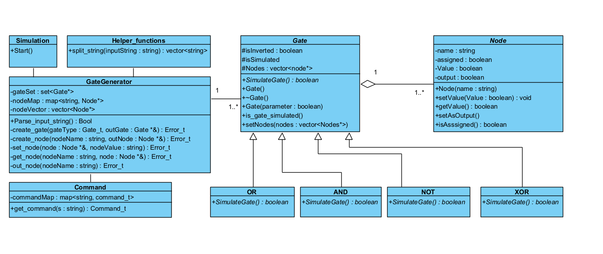
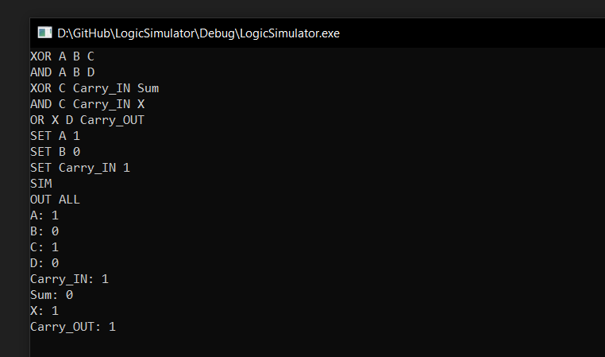

# LogicSimulator
This is The SI-Vision Embedded Software 2022 Advanced C++ Internship Final project.  
Youtube Discussion Video Link: https://youtu.be/BBtFGq3Z974

## UML Diagram

## Output Screenshot

## Future Work
- Inhance the UML Diagram
- inchance the input parsing state machine and generate its code based on the QM Modling Tool

### Overall The Project was too much fun and i really enjoyed doing it!
